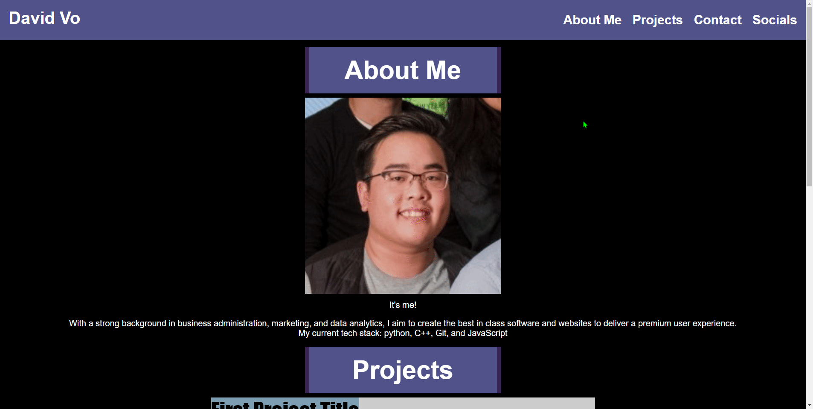

# My Personal Portfolio

## Technologies/Languages Used

Technologies Used:
* [HTML](https://developer.mozilla.org/en-US/docs/Web/HTML)
* [CSS](https://developer.mozilla.org/en-US/docs/Web/CSS)
* [Git](https://git-scm.com/)

## Description

This is my portfolio! Throughout my career, I'll be updating this webpage to reflect my top accomplishments and achievements as a software and web developer.

Having all of my works and projects on one page makes it easier for recruiters, managers, and, really, anyone to view my work for themselves along with the source code. Since this was my first web page that I've built out by myself, I expect to make many more design changes, optimizations, and updates to the portfolio itself.

If you'd like to view this portfolio for yourself, please visit: [David Vo's Portfolio](https://daevidvo.github.io/personal_portfolio/)

## Table of Contents

* [Description](#description)
* [Usage](#usage)
* [Author Info](#author-info)
* [Credits](#credits)
* [License](#license)

## Usage

If you'd like to view my portfolio, simply install this repo on to your local drive and open index.html in your browser.

Alternatively, you can also view this page online [using this link](https://daevidvo.github.io/personal_portfolio/).

## Author Info

I'm a currently student of the UC Berkeley Coding Bootcamp and am working towards mastering full stack development.

My professional background is in business administration and marketing so I understand what it takes to fully integrate the user experience into my code.

Current tech stack include:
* Python
* C++
* JavaScript
* HTML/CSS
* Lua

### Socials
* [Linkedin](https://www.linkedin.com/in/daevidvo)
* [Github](https://www.github.com/daevidvo)

## Credits

A very big shout out to Gumbo over on Stack Overflow for solving an initial problem with images in html having padding at the bottom of them. By utilizing vertical-align: bottom; I was able to get rid of the inherent padding on the bottom of images.

A link to the problem can be found here: [Why is there padding at the bottom of my image?](https://stackoverflow.com/questions/14053952/why-is-there-padding-at-the-bottom-of-my-image)

## License

MIT License

Copyright (c) 2023 daevidvo

Permission is hereby granted, free of charge, to any person obtaining a copy
of this software and associated documentation files (the "Software"), to deal
in the Software without restriction, including without limitation the rights
to use, copy, modify, merge, publish, distribute, sublicense, and/or sell
copies of the Software, and to permit persons to whom the Software is
furnished to do so, subject to the following conditions:

The above copyright notice and this permission notice shall be included in all
copies or substantial portions of the Software.

THE SOFTWARE IS PROVIDED "AS IS", WITHOUT WARRANTY OF ANY KIND, EXPRESS OR
IMPLIED, INCLUDING BUT NOT LIMITED TO THE WARRANTIES OF MERCHANTABILITY,
FITNESS FOR A PARTICULAR PURPOSE AND NONINFRINGEMENT. IN NO EVENT SHALL THE
AUTHORS OR COPYRIGHT HOLDERS BE LIABLE FOR ANY CLAIM, DAMAGES OR OTHER
LIABILITY, WHETHER IN AN ACTION OF CONTRACT, TORT OR OTHERWISE, ARISING FROM,
OUT OF OR IN CONNECTION WITH THE SOFTWARE OR THE USE OR OTHER DEALINGS IN THE
SOFTWARE.